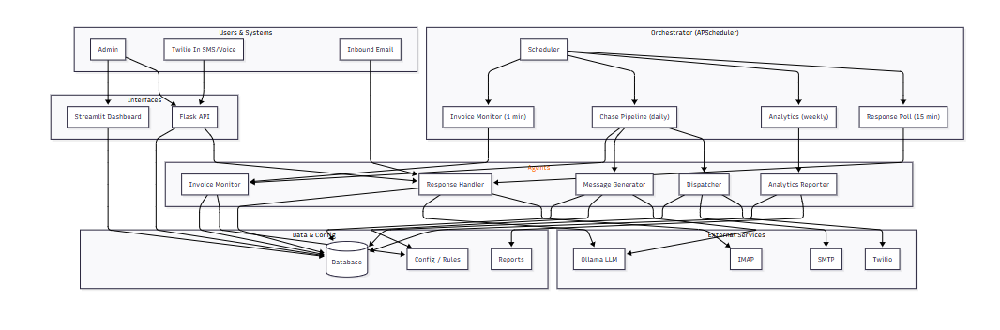
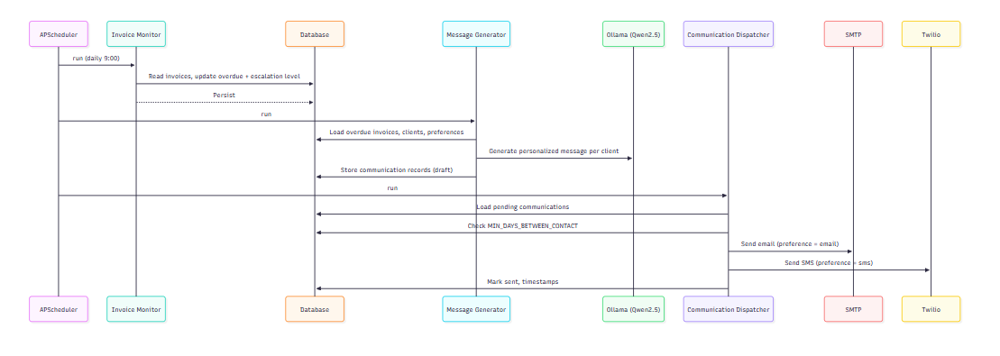
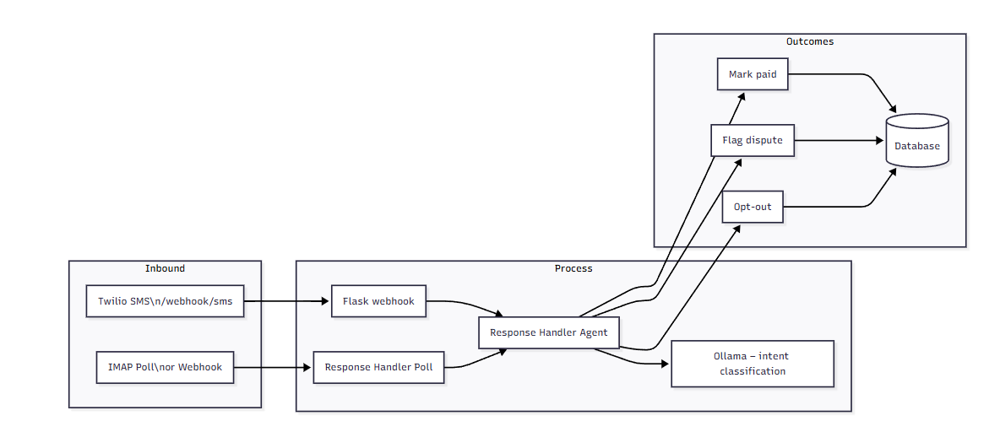

# Invoice Chaser

An AI-powered system that automates overdue invoice collection: monitors status, generates personalized escalation messages, dispatches via email/SMS, and processes customer responses—all while respecting contact preferences and escalation rules.

---

## Table of Contents

- [Problem Statement](#problem-statement)
- [Solution Overview](#solution-overview)
- [Architecture](#architecture)
- [Quick Start](#quick-start)
- [Setup & Configuration](#setup--configuration)
- [How to Use](#how-to-use)
- [Project Layout](#project-layout)
- [Technology Stack](#technology-stack)

---

## Problem Statement

Small businesses struggle with timely collection of overdue invoices. Manual follow-ups are:

- **Time-consuming** – Repetitive reminders eat into productive hours
- **Inconsistent** – Tone and timing vary with human workload
- **Delayed** – Overdue invoices sit unattended until someone remembers

There is a need for an automated, intelligent system that can monitor invoice status, generate context-aware escalation messages, dispatch them via preferred channels (email/SMS), and process customer responses—all while respecting contact preferences and escalation rules.

---

## Solution Overview

Invoice Chaser is a modular system built around **five coordinated agents**:

| Agent | Purpose |
|-------|---------|
| **Invoice Monitor** | Marks invoices overdue when due dates pass; assigns escalation levels (Lv1: 1–7 days, Lv2: 8–14 days, Lv3: 15+ days) |
| **Message Generator** | Uses Ollama (Qwen2.5) to create personalized email/SMS per client preference and escalation level; falls back to templates if LLM unavailable |
| **Communication Dispatcher** | Sends messages via SMTP (email) and Twilio (SMS); enforces `MIN_DAYS_BETWEEN_CONTACT` and optional business hours |
| **Response Handler** | Classifies inbound email/SMS intent (pay/dispute/ignore) via Ollama; updates invoice status; handles opt-out; keyword fallback when LLM unavailable |
| **Analytics Reporter** | Writes KPIs and reports to CSV |

An **APScheduler orchestrator** runs the pipeline on configurable schedules. A **Streamlit dashboard** provides a test UI with a clean-slate demo workflow. A **Flask API** exposes webhooks for Twilio and REST endpoints.

---

## Architecture

The architecture is illustrated by three diagrams. Each is embedded below with a detailed explanation.

---

### Diagram 1: High-Level System Architecture

This diagram shows the overall structure of Invoice Chaser across six logical domains: **Users & Systems**, **Interfaces**, **Orchestrator**, **Agents**, **Data & Config**, and **External Services**.

<p align="center">
  
</p>

**What the diagram shows:**

| Domain | Components | Role |
|--------|------------|------|
| **Users & Systems** | Admin, Twilio Inbound SMS/Voice, Inbound Email | The Admin operates the system; Twilio and IMAP deliver client replies (SMS, voice, email). |
| **Interfaces** | Streamlit Dashboard, Flask API | The Admin uses the dashboard to add clients/invoices and run the pipeline; the Flask API receives webhooks and exposes REST endpoints. |
| **Orchestrator** | Scheduler (orchestrator.py) | APScheduler triggers: Invoice Monitor (1 min), Chase Pipeline (daily 9:00), Analytics (weekly), Response Poll (15 min). |
| **Agents** | Invoice Monitor, Message Generator, Dispatcher, Response Handler, Analytics Reporter | Core business logic: monitor overdue, generate messages, send via SMTP/Twilio, classify replies, produce reports. |
| **Data & Config** | Database (SQLite), Config (escalation_rules.yaml), Reports | Central store for clients, invoices, communications; escalation rules; CSV reports. |
| **External Services** | Ollama (Qwen2.5), Twilio, SMTP, IMAP | LLM for message generation and intent classification; email/SMS delivery; inbound email polling. |

**Data flow:** Admin → Dashboard/API → Database. Orchestrator → Agents → Database. Agents → Ollama, SMTP, Twilio. Twilio/IMAP → Flask → Response Handler → Database.

---

### Diagram 2: Chase Pipeline (Daily Flow)

This sequence diagram shows the daily run at 9:00 AM: how the scheduler drives the Invoice Monitor, Message Generator, and Communication Dispatcher to identify overdue invoices, create messages, and send them.

<p align="center">
  
</p>

**What the diagram shows:**

| Phase | Step | Description |
|-------|------|-------------|
| **A. Invoice monitoring** | Scheduler → Monitor | APScheduler triggers the Invoice Monitor at 9:00. |
| | Monitor → Database | Monitor reads invoices, updates overdue status and escalation level (Lv1/Lv2/Lv3), and persists. |
| **B. Message generation** | Scheduler → Generator | Message Generator is invoked. |
| | Generator → Database | Loads overdue invoices, clients, and contact preferences. |
| | Generator → Ollama (Qwen2.5) | Generates personalized message per client (tone matches escalation level). |
| | Generator → Database | Stores draft `Communication` records (`sent_at` = NULL). |
| **C. Dispatch** | Scheduler → Dispatcher | Communication Dispatcher is invoked. |
| | Dispatcher → Database | Loads pending communications; checks `MIN_DAYS_BETWEEN_CONTACT`. |
| | Dispatcher → SMTP / Twilio | Sends email (preference = email) or SMS (preference = sms). |
| | Dispatcher → Database | Marks records as sent and stores timestamps. |

**End-to-end:** Overdue invoices are identified, messages are generated with Ollama, and they are sent via SMTP or Twilio according to client preference.

---

### Diagram 3: Response Handling Flow

This diagram shows how inbound client replies (SMS or email) are received, classified, and turned into database updates.

<p align="center">
  
</p>

**What the diagram shows:**

| Section | Components | Description |
|---------|-------------|-------------|
| **Inbound** | Twilio SMS (`/webhook/sms`), IMAP Poll or Webhook | Client SMS arrives via Twilio webhook; email arrives via IMAP poll or webhook. |
| **Process** | Flask webhook, Response Handler Poll, Response Handler Agent, Ollama | The webhook or poll passes the message to the Response Handler Agent, which uses **Ollama** to classify intent: `pay`, `dispute`, `ignore`, or `opt_out`. |
| **Outcomes** | Mark paid, Flag dispute, Opt-out, Database | Based on intent: invoice is marked paid or promise-to-pay; dispute is flagged (with optional auto-reply); opt-out is recorded. All outcomes update the **Database**. |

**Flow:** SMS/Email → Flask or Poll → Response Handler → Ollama (intent) → Mark paid / Flag dispute / Opt-out → Database.

**Demo:** The dashboard **Mock client reply** simulates an inbound message; the Response Handler processes it and updates invoice status.

---

## Quick Start

### Prerequisites

- Python 3.10+
- Ollama (optional; `ollama run qwen2.5:7b-instruct-q4_K_M` for LLM features; keyword fallback when unavailable)

### Installation

```bash
pip install -r requirements.txt
cp .env.example .env
```

Edit `.env` with SMTP credentials to send emails. Do not commit `.env`.

### Demo Workflow (4 steps)

```bash
streamlit run dashboard.py
```

1. **Clients Dashboard** → **Add Client** (name, email; contact preference: Email)
2. **Clients Dashboard** → **Add Invoice** (select client, amount, due date 7 days ago)
3. **Pipeline** tab → **Run pipeline now** (Monitor → Generator → Dispatcher)
4. **Pipeline** tab → **Mock client reply** → Type "I'll pay by Friday" → **Send** (Response Handler updates invoice to `promise_to_pay`)

> **Fresh data?** If you need a clean slate, use **Settings** → **Reset database** first.

**Optional:** `python -m db.seed_sample_data` creates 3 sample clients/invoices. `python run_demo.py` runs the pipeline headless.

---

## Setup & Configuration

### Orchestrator (Scheduled Pipeline)

```bash
python orchestrator.py
```

Runs Invoice Monitor (1 min), Chase Pipeline (daily), Analytics (weekly), Response Poll (15 min). Configure via `CRON_*` env vars.

### Web API and Webhooks

```bash
python -m web.app
```

- **Twilio webhook:** `https://your-host/webhook/sms` for inbound SMS
- **REST API:** `/api/clients`, `/api/invoices`, `/api/overview`, `/api/pipeline/*`

### Environment Variables

| Variable | Purpose |
|----------|---------|
| `DATABASE_URL` | SQLAlchemy URL (default: `sqlite:///invoice_chaser.db`) |
| `OLLAMA_API_URL`, `OLLAMA_MODEL` | Ollama endpoint and model |
| `TWILIO_ACCOUNT_SID`, `TWILIO_AUTH_TOKEN`, `TWILIO_FROM_NUMBER` | Twilio SMS/voice |
| `SMTP_HOST`, `SMTP_PORT`, `SMTP_USER`, `SMTP_PASSWORD`, `SMTP_FROM` | Email sending |
| `IMAP_HOST`, `IMAP_USER`, `IMAP_PASSWORD` | Optional inbound email |
| `MIN_DAYS_BETWEEN_CONTACT` | Skip send if last contact within N days (default 3) |
| `BUSINESS_HOURS_START`, `BUSINESS_HOURS_END` | 8–20 for compliance; 0–24 to disable |
| `REPORT_DIR` | Analytics output (default `reports`) |
| `CRON_CHASE` | Cron for daily pipeline (default `0 9 * * *` = 9:00 AM) |

**Credential security:** Store all secrets in `.env`. Use `.env.example` as a template. Do not commit `.env`.

---

## How to Use

### Dashboard Pages

| Page | Features |
|------|----------|
| **Clients Dashboard** | Add Client / Add Invoice → Success Analytics (collection rate, ROI, CSV export) → Client list with escalation stepper (Lv1→Lv2→Lv3) → Expand for timeline (Template vs LLM preview) → Send Next, Mark Paid, Simulate Reply |
| **Pipeline Viewer** | **Run pipeline now** (live steps) → **Mock client reply** → Processing log with full invoice timeline (click expand) |
| **Settings** | Refresh, **Reset database (clean slate)** |

### Invoice Timeline

Click any invoice in the Pipeline processing log to see the **full processing timeline** (real data only):

- Invoice created
- Outbound messages (Lv1/Lv2/Lv3, sent/pending, template vs LLM)
- Skipped sends (business hours compliance)
- Response intent and actions

### Escalation Levels

| Level | Days overdue | Tone |
|-------|--------------|------|
| 1 | 1–7 | Friendly reminder |
| 2 | 8–14 | Firm |
| 3 | 15+ | Urgent / final notice |

Rules are configurable in `config/escalation_rules.yaml`.

### Tips

- **Ollama optional:** Response Handler has a keyword fallback when Ollama is unavailable ("I'll pay", "I've paid" → pay intent).
- **SMTP required for sending:** Configure `SMTP_USER`, `SMTP_PASSWORD` in `.env`; otherwise messages stay pending.
- **Dispatcher sends email only** by default; SMS via Twilio requires additional setup.

---

## Project Layout

```
├── db/              # Models, database (reset_db() for clean slate), seed data
├── agents/          # Invoice monitor, message generator, dispatcher, response handler, analytics
├── config/          # escalation_rules.yaml
├── web/             # Flask app (webhooks, REST API)
├── docs/            # Architecture Mermaid sources
├── orchestrator.py  # APScheduler entrypoint
├── dashboard.py     # Streamlit dashboard (demo workflow, pipeline, mock reply)
├── run_demo.py      # One-shot pipeline run
├── highlevel.png    # High-level architecture diagram
├── chase.png        # Chase pipeline sequence diagram
└── response.png     # Response handling flow diagram
```

---

## Technology Stack

### AI/ML

| Resource | License |
|----------|---------|
| Ollama | MIT |
| Qwen2.5 7B Instruct (via Ollama) | Apache 2.0 |

### Python Libraries

| Library | Purpose |
|---------|---------|
| SQLAlchemy ≥2.0 | ORM and database |
| APScheduler | Scheduled jobs |
| Flask | Web API and webhooks |
| Streamlit | Admin dashboard |
| Pydantic | Data validation |
| python-dotenv | Environment config |
| PyYAML | Config parsing |
| Twilio | SMS and voice |
| imapclient | IMAP email polling |
| pandas | Data analysis |
| matplotlib, seaborn | Charts and reports |
| pytest | Testing |

### External Services

- **Twilio** – SMS delivery and level-3 voice escalation
- **SMTP (e.g., Gmail)** – Outbound email
- **IMAP (e.g., Gmail)** – Optional inbound email polling

---

Mermaid sources for the architecture diagrams are in **[docs/architecture.md](docs/architecture.md)**.

*This project uses third-party open-source libraries and APIs as documented above. All credentials are managed via environment variables and are not hardcoded in the codebase.*
