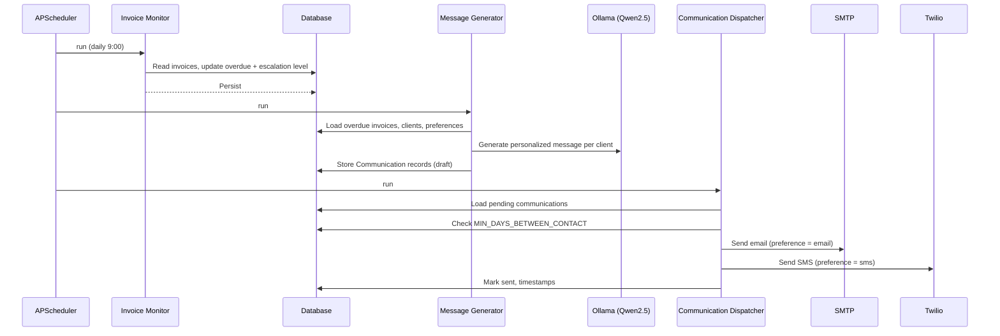
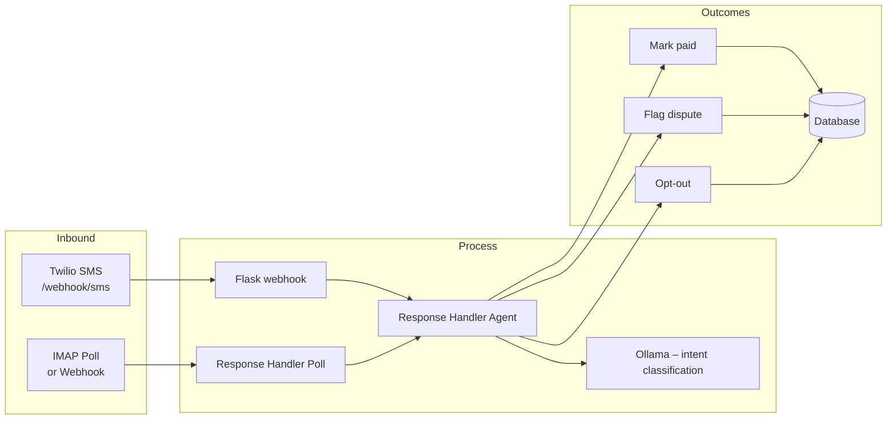

# Invoice Chaser – Architecture Diagram

## High-level architecture

```mermaid
flowchart TB
    subgraph Users["👤 Users & Systems"]
        Admin[Admin / Operator]
        TwilioIn[Twilio Inbound SMS/Voice]
        EmailIn[Inbound Email IMAP]
    end

    subgraph Interfaces["Interfaces"]
        Dashboard["Streamlit Dashboard\n(dashboard.py)"]
        FlaskAPI["Flask API\n(web/app)"]
    end

    subgraph Orchestrator["Orchestrator (APScheduler)"]
        direction TB
        Scheduler[orchestrator.py]
        Scheduler --> MonitorJob[Invoice Monitor\n(every 1 min)]
        Scheduler --> ChaseJob[Chase Pipeline\n(daily 9:00)]
        Scheduler --> AnalyticsJob[Analytics Reporter\n(weekly Mon 8:00)]
        Scheduler --> ResponsePoll[Response Handler Poll\n(every 15 min)]
    end

    subgraph Agents["Agents"]
        InvoiceMonitor[Invoice Monitor\nMark overdue, set escalation level]
        MessageGen[Message Generator\nOllama LLM – personalized email/SMS]
        Dispatcher[Communication Dispatcher\nSMTP + Twilio send]
        ResponseHandler[Response Handler\nClassify intent, update status, opt-out]
        AnalyticsReporter[Analytics Reporter\nKPIs & reports → CSV]
    end

    subgraph Data["Data & Config"]
        DB[(SQLite / DB\nSQLAlchemy)]
        Config[config/escalation_rules.yaml]
        Reports[reports/ CSV]
    end

    subgraph External["External Services"]
        Ollama[Ollama\nQwen2.5 LLM]
        Twilio[Twilio\nSMS & Voice]
        SMTP[SMTP\nOutbound Email]
        IMAP[IMAP\nInbound Email]
    end

    Admin --> Dashboard
    Admin --> FlaskAPI
    TwilioIn --> FlaskAPI
    FlaskAPI --> ResponseHandler

    Dashboard --> DB
    FlaskAPI --> DB
    FlaskAPI --> ResponseHandler

    MonitorJob --> InvoiceMonitor
    ChaseJob --> InvoiceMonitor
    ChaseJob --> MessageGen
    ChaseJob --> Dispatcher
    AnalyticsJob --> AnalyticsReporter
    ResponsePoll --> ResponseHandler

    InvoiceMonitor --> DB
    InvoiceMonitor --> Config
    MessageGen --> DB
    MessageGen --> Config
    MessageGen --> Ollama
    Dispatcher --> DB
    Dispatcher --> SMTP
    Dispatcher --> Twilio
    ResponseHandler --> DB
    ResponseHandler --> Ollama
    ResponseHandler --> IMAP
    AnalyticsReporter --> DB
    AnalyticsReporter --> Reports
```

## Chase pipeline (daily flow)



## Response handling flow



## Component summary

| Component | Purpose |
|-----------|---------|
| **Streamlit Dashboard** | Test UI: overview, invoices, clients, message generator, response handling, pipeline controls |
| **Flask API** | REST (`/api/clients`, `/api/invoices`, `/api/overview`, `/api/pipeline/*`), Twilio webhooks (`/webhook/sms`, `/twilio/voice/escalation`) |
| **Orchestrator** | APScheduler: invoice monitor (1 min), chase pipeline (daily), analytics (weekly), response poll (15 min) |
| **Invoice Monitor** | Mark invoices overdue, set escalation level (1: 1–7d, 2: 8–14d, 3: 15+d) from `escalation_rules.yaml` |
| **Message Generator** | Builds personalized email/SMS via Ollama; respects client preference and escalation tone |
| **Communication Dispatcher** | Sends via SMTP and Twilio; enforces `MIN_DAYS_BETWEEN_CONTACT` |
| **Response Handler** | Classifies inbound email/SMS (pay / dispute / ignore); updates invoice status; handles opt-out |
| **Analytics Reporter** | Writes KPIs and reports to CSV in `REPORT_DIR` |
